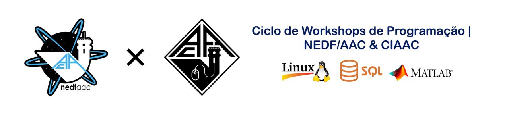

# Workshop SQL
---

The code and resources available in this repository are to be used only in the scope of the _Workshop SQL_.

* **IMPORTANT:** If you plan to do the practical part of the Workshop in your computer you should instal `docker` in your computer **BEFORE** the Workshop.

You should also clone this repository into your computer and try the instructions below before the workshop.

## Requirements

To follow the practical examples of the workshop, it is required to have installed:

- `docker`

### Installing Docker

1. Download the specific installer for your operating system from: [https://docs.docker.com/get-docker/](https://docs.docker.com/get-docker/)
2. Follow the steps for the specific case.

**Possible Problem**

`WSL 2 installation is incomplete`

If you encounter this problem follow the link presented in the warning window:

[https://aka.ms/wsl2kernel](https://aka.ms/wsl2kernel)

Download the windows subsystem for linux and run it. Docker should work after a reboot.

## How to use 

To start the database container, open a terminal window or command prompt and use:

* `.\database.bat`  _(Windows)_
* `sh database.sh`  _(MacOS or Linux)_

This command will print the IP address of the container, which you will need later

after:

* `.\client.bat`    _(Windows)_
* `sh client.sh`    _(MacOS or Linux)_

inside it:

* `psql -h <IP> -p 5432 -d workshop -U workshop -W`

For example: `psql -h 172.17.0.2 -p 5432 -d workshop -U workshop -W`

pass: `workshop`

## Authors

* Nuno Antunes <nmsa@dei.uc.pt>
* José Flora   <jeflora@dei.uc.pt>
* University of Coimbra